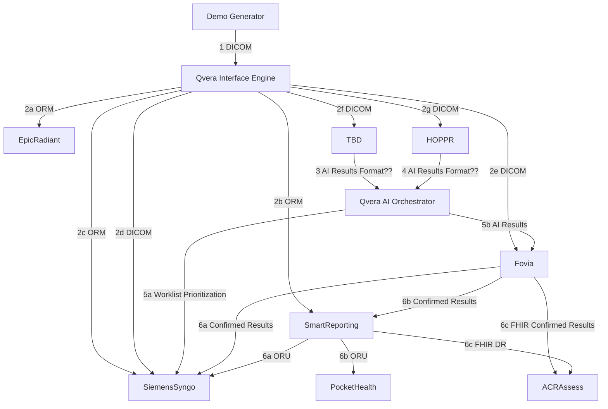

# Team Curie
## Chest CT Flow Chart

```mermaid
flowchart TD
    Generator[Demo Generator] --> |1 DICOM| QveraIE[Qvera Interface Engine]

    QveraIE --> |2a ORM| EpicRadiant
    QveraIE --> |2b ORM| SmartReporting
    QveraIE --> |2c ORM| SiemensSyngo
    QveraIE --> |2d DICOM| SiemensSyngo
    QveraIE --> |2e DICOM| Fovia
    QveraIE --> |2f DICOM| TBD
    QveraIE --> |2g DICOM| HOPPR
    
    TBD --> |3 AI Results Format??| QveraAIO[Qvera AI Orchestrator]

    HOPPR --> |4 AI Results Format??| QveraAIO

    QveraAIO --> |5a Worklist Prioritization| SiemensSyngo
    QveraAIO --> |5b AI Results| Fovia

    Fovia --> |6a Confirmed Results| SiemensSyngo
    Fovia --> |6b Confirmed Results| SmartReporting
    Fovia --> |6c FHIR Confirmed Results| ACRAssess

    SmartReporting --> |6a ORU| SiemensSyngo
    SmartReporting --> |6b ORU| PocketHealth
    SmartReporting --> |6c FHIR DR| ACRAssess
```
