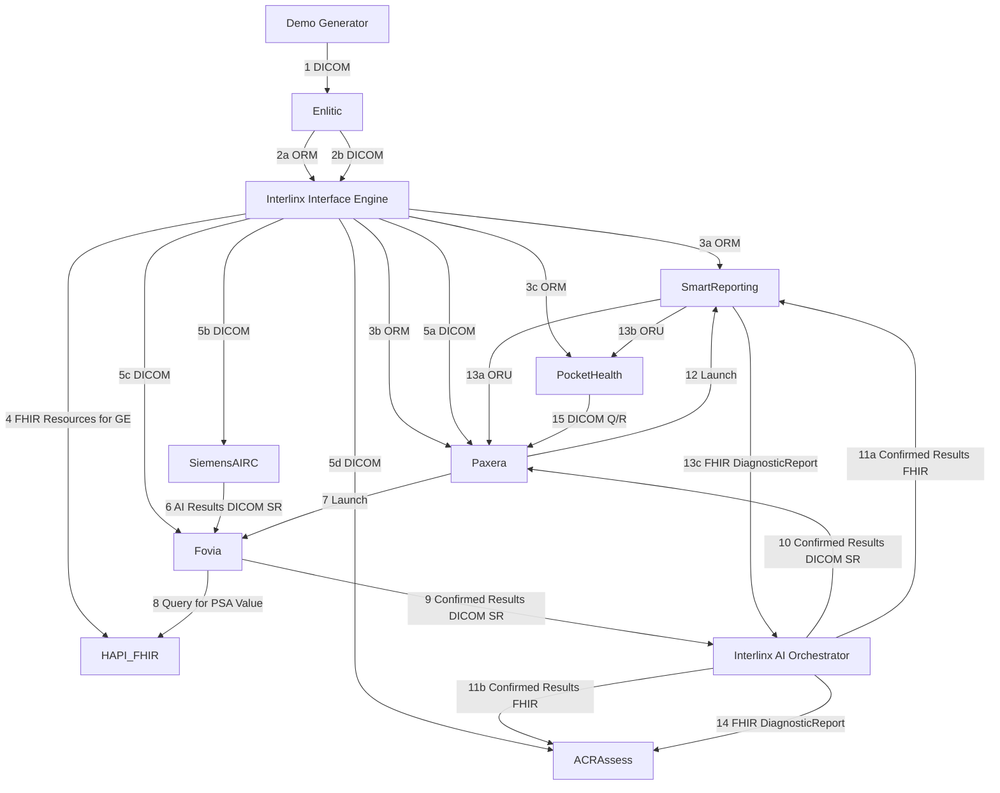

# Team Ettinger
## Prostate Flow Chart

```mermaid
flowchart TD
    Generator[Demo Generator] --> |1 DICOM| Enlitic

    Enlitic --> |2a ORM| InterlinxIE[Interlinx Interface Engine]
    Enlitic --> |2b DICOM| InterlinxIE

    InterlinxIE --> |3a ORM| SmartReporting
    InterlinxIE --> |3b ORM| Paxera
    InterlinxIE --> |3c ORM| PocketHealth

    InterlinxIE --> |4 FHIR Resources for GE| HAPI_FHIR

    InterlinxIE --> |5a DICOM| Paxera
    InterlinxIE --> |5b DICOM| SiemensAIRC
    InterlinxIE --> |5c DICOM| Fovia
    InterlinxIE --> |5d DICOM| ACRAssess

    SiemensAIRC --> |6 AI Results DICOM SR| Fovia

    Paxera --> |7 Launch| Fovia

    Fovia --> |8 Query for PSA Value| HAPI_FHIR

    Fovia --> |9 Confirmed Results DICOM SR| InterlinxAIO[Interlinx AI Orchestrator]

    InterlinxAIO --> |10 Confirmed Results DICOM SR| Paxera
    
    InterlinxAIO --> |11a Confirmed Results FHIR| SmartReporting
    InterlinxAIO --> |11b Confirmed Results FHIR| ACRAssess

    Paxera --> |12 Launch| SmartReporting

    SmartReporting --> |13a ORU| Paxera
    SmartReporting --> |13b ORU| PocketHealth
    SmartReporting --> |13c FHIR DiagnosticReport| InterlinxAIO

    InterlinxAIO --> |14 FHIR DiagnosticReport| ACRAssess

    PocketHealth --> |15 DICOM Q/R| Paxera
```
