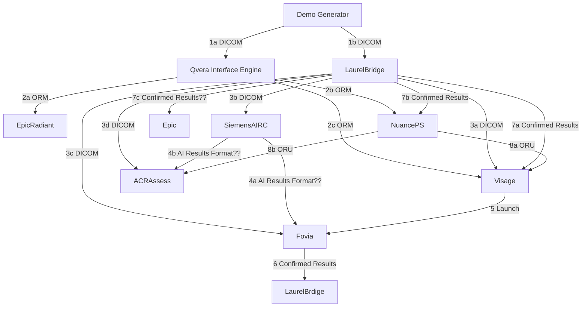

# Team Quimby
## Brain Scan 1 (Siemens AIRC)

```mermaid
flowchart TD
    Generator[Demo Generator] --> |1a DICOM| QveraIE[Qvera Interface Engine]
    Generator --> |1b DICOM| LaurelBridge

    QveraIE --> |2a ORM| EpicRadiant
    QveraIE --> |2b ORM| NuancePS
    QveraIE --> |2c ORM| Visage

    LaurelBridge --> |3a DICOM| Visage
    LaurelBridge --> |3b DICOM| SiemensAIRC
    LaurelBridge --> |3c DICOM| Fovia
    LaurelBridge --> |3d DICOM| ACRAssess
    
    SiemensAIRC --> |4a AI Results Format??| Fovia
    SiemensAIRC --> |4b AI Results Format??| ACRAssess

    Visage --> |5 Launch| Fovia

    Fovia --> |6 Confirmed Results| LaurelBrdige
    
    LaurelBridge --> |7a Confirmed Results| Visage
    LaurelBridge --> |7b Confirmed Results| NuancePS
    LaurelBridge --> |7c Confirmed Results??| Epic

    NuancePS --> |8a ORU| Visage
    NuancePS --> |8b ORU| ACRAssess
```
