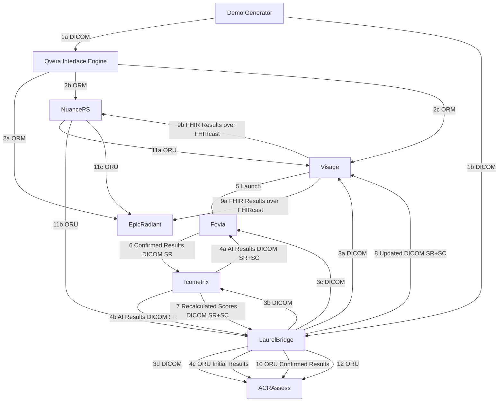

# Team Quimby
## Brain Scan 2 (Icometrix)

```mermaid
flowchart TD
    Generator[Demo Generator] --> |1a DICOM| QveraIE[Qvera Interface Engine]
    Generator --> |1b DICOM| LaurelBridge

    QveraIE --> |2a ORM| EpicRadiant
    QveraIE --> |2b ORM| NuancePS
    QveraIE --> |2c ORM| Visage

    LaurelBridge --> |3a DICOM| Visage
    LaurelBridge --> |3b DICOM| Icometrix
    LaurelBridge --> |3c DICOM| Fovia
    LaurelBridge --> |3d DICOM| ACRAssess
    
    Icometrix --> |4a AI Results DICOM SR+SC| Fovia
    Icometrix --> |4b AI Results DICOM SR| LaurelBridge
    LaurelBridge --> |4c ORU Initial Results| ACRAssess

    Visage --> |5 Launch| Fovia

    Fovia --> |6 Confirmed Results DICOM SR| Icometrix

    Icometrix --> |7 Recalculated Scores DICOM SR+SC| LaurelBridge

    LaurelBridge --> |8 Updated DICOM SR+SC| Visage

    Visage --> |9a FHIR Results over FHIRcast| EpicRadiant
    Visage --> |9b FHIR Results over FHIRcast| NuancePS

    LaurelBridge --> |10 ORU Confirmed Results| ACRAssess

    NuancePS --> |11a ORU| Visage
    NuancePS --> |11b ORU| LaurelBridge
    NuancePS --> |11c ORU| EpicRadiant

    LaurelBridge --> |12 ORU| ACRAssess
```
