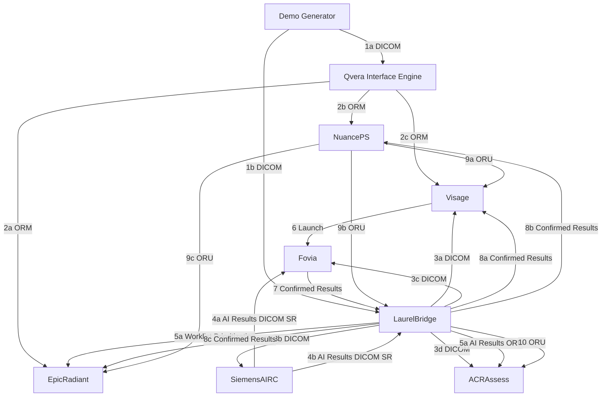

# Team Quimby
## Chest XR (Tube Misplacement)

```mermaid
flowchart TD
    Generator[Demo Generator] --> |1a DICOM| QveraIE[Qvera Interface Engine]
    Generator --> |1b DICOM| LaurelBridge

    QveraIE --> |2a ORM| EpicRadiant
    QveraIE --> |2b ORM| NuancePS
    QveraIE --> |2c ORM| Visage

    LaurelBridge --> |3a DICOM| Visage
    LaurelBridge --> |3b DICOM| SiemensAIRC
    LaurelBridge --> |3c DICOM| Fovia
    LaurelBridge --> |3d DICOM| ACRAssess
    
    SiemensAIRC --> |4a AI Results DICOM SR| Fovia
    SiemensAIRC --> |4b AI Results DICOM SR| LaurelBridge

    LaurelBridge --> |5a Worklist Prioritization| EpicRadiant
    LaurelBridge --> |5a AI Results ORU| ACRAssess

    Visage --> |6 Launch| Fovia

    Fovia --> |7 Confirmed Results| LaurelBridge
    
    LaurelBridge --> |8a Confirmed Results| Visage
    LaurelBridge --> |8b Confirmed Results| NuancePS
    LaurelBridge --> |8c Confirmed Results | EpicRadiant

    NuancePS --> |9a ORU| Visage
    NuancePS --> |9b ORU| LaurelBridge
    NuancePS --> |9c ORU| EpicRadiant

    LaurelBridge --> |10 ORU| ACRAssess
```
