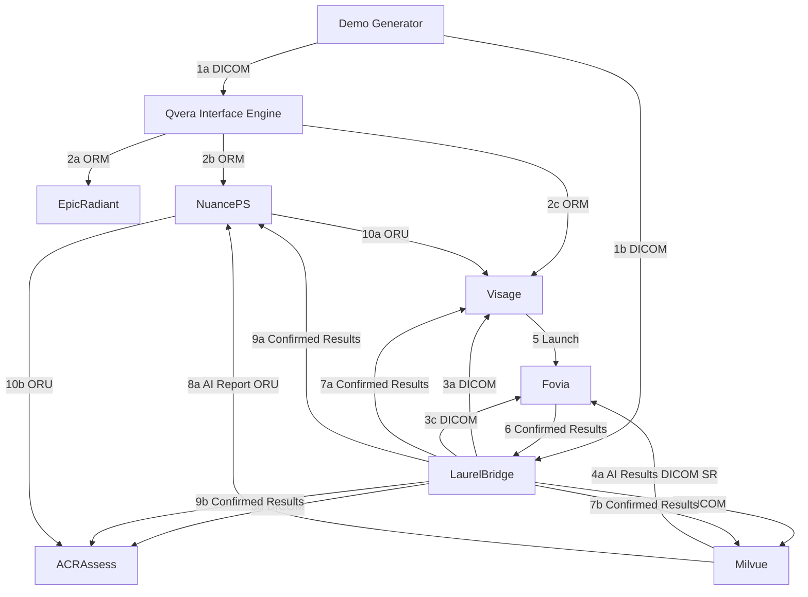

# Team Quimby
## Fall Radiograph Flow Chart

```mermaid
flowchart TD
    Generator[Demo Generator] --> |1a DICOM| QveraIE[Qvera Interface Engine]
    Generator --> |1b DICOM| LaurelBridge
    
    QveraIE --> |2a ORM| EpicRadiant
    QveraIE --> |2b ORM| NuancePS
    QveraIE --> |2c ORM| Visage

    LaurelBridge --> |3a DICOM| Visage
    LaurelBridge --> |3b DICOM| Milvue
    LaurelBridge --> |3c DICOM| Fovia
    LaurelBridge --> |3d DICOM| ACRAssess
    
    Milvue --> |4a AI Results DICOM SR| Fovia    
    Visage --> |5 Launch| Fovia

    Fovia --> |6 Confirmed Results| LaurelBridge

    LaurelBridge --> |7a Confirmed Results| Visage
    LaurelBridge --> |7b Confirmed Results| Milvue
    
    Milvue --> |8a AI Report ORU | NuancePS

    LaurelBridge --> |9a Confirmed Results| NuancePS
    LaurelBridge --> |9b Confirmed Results| ACRAssess
   
    NuancePS --> |10a ORU| Visage
    NuancePS --> |10b ORU| ACRAssess
```
